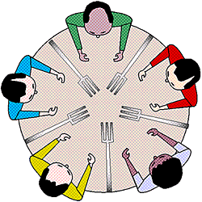

# Dining Philosophers Problem

## Overview

This project explores a classic concurrency problem: the Dining Philosophers. It simulates philosophers sitting at a round table who can only think or eat. To eat, each philosopher needs two forks (one on each side). Unrestricted access to forks can lead to deadlock (a state where no progress can be made).



## Problem Variations
This project explores 2 variants of the above problem:

- **Classic:** The standard Dining Philosophers problem with forks.

- **Twist:** Introduces bowls as another shared resource required by philosophers to eat, along with forks.


### Deadlock Resolution Techniques

- **Strict Ordering:** Philosophers acquire forks in a specific order (P0: right first, left second, others: left first, right second) to prevent deadlocks. Each philospher is represented by thread

- **Semaphores:** Each Philosopher is represented by semaphore. They can be in 3 states: `THINKING`, `HUNGRY` or `EATING`. Philosophers can only eat if their neighbors aren't eating. A mutex ensures mutually exclusive access to forks, avoiding potential deadlocks.

### Building and Running 

1. **Navigate:** Change directory (cd) to the project folder.
2. **Build:** Run `make all` to compile the code.
3. **Running with Strict Ordering:** Run `make runStrictOrder`.
4. **Running with Semaphores:** Run`make runSemaphore`.

### Sample Output

Here is some small snippet from running the twist version that involves bowls. Please refer to `sample_outpts` folder for more detailed logs.

```txt
Philosopher 1 finished eating
Philosopher 2 picked up fork 1
Philosopher 0 has put down fork 1
Philosopher 4 picked up fork 0
Philosopher 0 has put down fork 4
Philosopher 0 has put down bowl 0
Philosopher 0 started thinking
Philosopher 1 has put down fork 0
```

### References
https://en.wikipedia.org/wiki/Dining_philosophers_problem